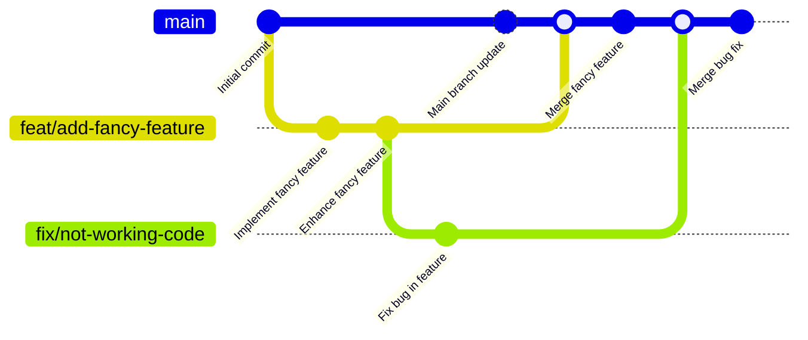

# Contributing

The project strictly follows the below guidelines. All work is tracked within the repository with issues and pull requests. In addition we use milestones to track
progress and classify issues. Issue creation requirements:

- Write a clear and descriptive title
- Describe the issue in detail (what, why, where)
- Provide a possible solution approach (if possible)
- Assign the appropriate labels
- Assign the issue to the Backlog milestone
- Dont assign a responsible person

## Feature Branch Workflow

The project uses the feature branch workflow. The `main` branch is the production branch. All development is done in feature branches. The feature branches are merged
into the `main` branch via pull requests. The feature branches should follow below mentioned naming convention. When creating a new branch also create a pull request
and reference the issue that pull request is addressing. Before merging rebase the feature branch on the `main` branch.



**Branch Naming Convention**

```text
<type>/<short-description>
```
- See valid types below in the conventional commits section

## Conventional Commits

The project uses conventional commits. The commit message should be structured as follows:

```text
<type>[optional scope]: <description>
```

**Type:**
- `feat`: A new feature
- `fix`: A bug fix
- `docs`: Documentation only changes
- `style`: Linting and formatting changes
- `refactor`: Code changes that neither fixes a bug nor adds a feature
- `test`: Adding missing tests or correcting existing tests
- `chore`: Changes to the build process or auxiliary tools and libraries
- `perf`: A code change that improves performance
- `deps`: A dependency update

**Scope:**

The scope could be anything which specifies a specific part of the project which the commit is addressing.

### Example

```text
feat: add frontend setup
feat(api): add user me endpoint
fix(app): fix color of submit button
docs: add build documentation
refactor(api): remove unused function
```
