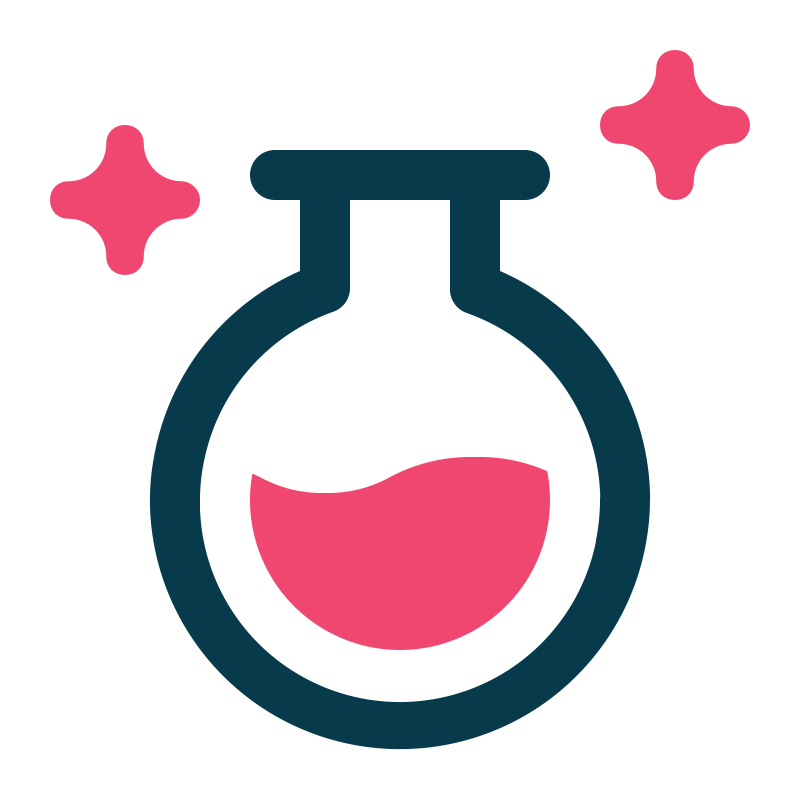

# The End of Dev Confusion: How Grimoire Becomes Your Smartest Teammate

<p align="center">
  
</p>

> A local first AI assistant that helps developers onboard faster, navigate unfamiliar codebases, and retrieve contextual knowledge securely, efficiently, and in your own environment.

---

## Why Every Codebase Feels Like a Black Box

Whether you're joining a new team, picking up a legacy project, or diving into unfamiliar logic, one thing quickly becomes clear: **the hardest part isn’t writing new code, it’s understanding the existing one.** 
The problem isn't a lack of skill; it's a lack of context. 
Documentation is often outdated, incomplete, or spread across multiple sources. Internal APIs behave opaquely, with their logic hidden in layers of abstraction. Crucial details live in Slack threads, commit messages, or more frustratingly in someone’s head. And while tools like GPT-based chats or simple terminal commands like grep offer some help, they lack awareness of the specific structure and nuances of your project. 
The result? Developers spend more time figuring out how things work than actually getting work done.

---

## Enter *grimoire*

*grimoire* is an open-source, local-first AI assistant that understands your codebase.  
It uses **Retrieval-Augmented Generation (RAG)** to let you ask natural language questions and receive answers grounded in your own code and documentation.

There’s no cloud upload, no privacy risks and no guesswork.

- It runs locally  
- It understands your actual project  
- It gives **direct and contextual** answers  

---

## Why *grimoire* Matters

Modern software stacks are complex. Multiple languages, microservices, fast moving changes, it’s harder than ever to keep track of how things actually work.

*grimoire* fills this gap. It’s not just an AI chat, it’s a knowledge engine that lives with your codebase.

**It doesn’t replace developers, it empowers them.**

By giving fast, accurate answers rooted in your actual repo, *grimoire* helps with:

- Onboarding
- Debugging
- Reviewing old code
- Understanding internal dependencies

And all without leaving your terminal.

---

## What Sets *grimoire* Apart

**Built for Developers**  
CLI-based, written in Python, powered by `pgvector`, and fully configurable via YAML.  
Whether you want to fine-tune chunking or just run `grim sync`, it’s flexible and intuitive.

**Privacy by Design**  
No source code ever leaves your machine unless *you* decide. Works fully offline or on secure infrastructure.

**Semantic Indexing**  
*grimoire* parses code and docs using `Tree-sitter` and `LangChain`, embeds them with BGE-M3 and stores them in a high performance vector DB.

**Team-Ready**  
Use a shared vector store in your team or CI/CD pipeline,  no need to reindex the same repo twice.

---

## Under the Hood: A Simplified View

Here’s what happens under the surface:

1. **Repository Sync**  
   *grimoire* clones and analyzes the repositories you define in `grimoire.yaml`.

2. **Chunking & Embedding**  
   Using syntax-aware parsing, it segments code and docs into meaningful pieces and embeds them with transformer models.

3. **Storage & Search**  
   These vectors are stored in `pgvector`. When you ask something, *grimoire* searches for the most relevant chunks.

4. **Response Generation**  
   The retrieved context is passed to an LLM, which returns an answer based on your actual codebase.

---

## Getting Started in 60 Seconds

Install and initialize your project with:

**TODO:** Add correct code examples here.
```bash
grim init
grim sync
grim ask "Where does the authentication token come from?"
```

That’s it, no setup overhead, no waiting, just instant answers from your own repo.

## Common Use Cases

**Onboarding**:
New hires can understand architecture, dependencies, and flows without pinging senior devs.

**Debugging**:
Find where things break and how they connect — even in code you’ve never touched before.

**Living Documentation**:
Each Q&A interaction acts like a knowledge trail that helps others later.

## The Big Picture

*grimoire* was created to solve a very real problem:

Developers spend more time understanding code than writing it.

By bringing RAG to your local environment and indexing the code and docs you already have, *grimoire* turns every repository into a searchable knowledge base.

And it’s just the beginning.

Future plans include:

- Deeper IDE integration (e.g., inline completions in VS Code)
- Shared vector infrastructure for teams
- Plugin architecture for custom backends and workflows

## What’s Next?

In a world where engineering speed depends on comprehension, *grimoire* is a step toward smarter, faster and more confident development. Whether you're at a startup or a Fortune 500, its privacy first, local first approach scales with your needs.

Try it, fork it, contribute to it:
https://github.com/BDP25/grimoire

Let *grimoire* be your context aware teammate and never get lost in your codebase again.

---

**Authors:**  
*Céline Felix*, *John Truninger*, *Kirishana Kiritharan*  
ZHAW School of Engineering, 2025

tags: [AI, RAG, CLI, onboarding, grimoire]
