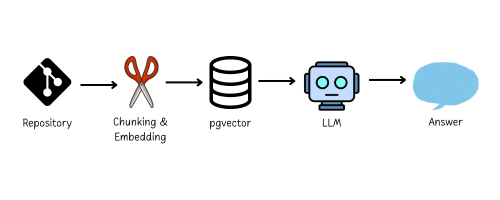

# The End of Dev Confusion: How *grimoire* Becomes Your Smartest Teammate

<p align="center">
  
</p>

Ever joined a new project and stared at unfamiliar code, trying to figure out what the previous developer was thinking?
You’re not alone. Whether it’s a legacy app, a rapidly evolving microservice, or a stack held together by duct tape and shell scripts the problem is always the same: it’s not the code itself that’s hard, it’s the context that’s missing.
Most of us spend hours reverse engineering codebases we didn’t write. We search endlessly through outdated docs, jump between functions, guess dependencies, and ping colleagues who maybe remember what a function from two years ago was supposed to do.
And modern tools? They help sometimes. GPT based chats can answer general questions. grep can find you words. But these tools don’t know your architecture. They can’t read your config. They have no clue about your folder structure or the weird edge case buried in your utils.py.

So we built *grimoire*.🪄

## An assistant that knows your project

*grimoire* is a local first AI assistant that understands your actual codebase not the internet’s, not Stack Overflow’s, but yours.
You install it. You tell it which repositories to index. It reads your docs and your code, builds a searchable semantic map of everything and then it just sits in your terminal, waiting for your next question. No setup nightmares. No cloud dependency. Just you, your terminal, and a tool that gets it.

<br>Want to know where the auth_token gets validated? <br>
You ask: grim ask "Where is the authentication logic handled?"
<br>And *grimoire* replies based on your own code and your own docs.🎯<br>

The magic behind it? *grimoire* splits your code into meaningful chunks, embeds it using a multilingual transformer model, stores it in a high performance vector database (pgvector), and retrieves the most relevant pieces when you ask something.
It’s like semantic grep, with memory.

## How it works behind the scenes 

<p align="center">  </p>

From repository to response, *grimoire* creates a local, project specific knowledge base. Code and docs are parsed and chunked with LangChain and Tree-sitter, embedded with transformer models like BGE-M3, stored in pgvector, and retrieved on demand. The result is a smart assistant that doesn’t hallucinate because it knows your repository better than you do.🧙‍♀️

## Built for developers

*grimoire* was created with one core belief: developers should spend less time reading code and more time understanding it.
It runs fully locally or on infrastructure you control. That means no source code ever leaves your machine. If you're working in a company with privacy policies or compliance needs, you're safe. It just works. Offline, private, and secure by design. And if you're on a team? Even better. You can share the vector index across machines. No need for everyone to resync the same repository. It’s fast, efficient, and scales with your workflow. Setup is just as smooth. You define your indexing scope in a grimoire.yaml file, choose your chunking rules, run grim sync, and from there it’s just grim ask. Easy.

## So why does it matter?

Modern dev environments are chaos. Multiple services. Internal APIs calling external APIs. Ever changing configurations. And a constant stream of new engineers joining teams. *grimoire* helps you make sense of it all. It’s not just another AI chatbot. It’s a developer native context engine. It’s a memory layer that lives alongside your codebase and evolves with it. And it’s not trying to replace anyone. *grimoire* simply helps you ask better questions and get grounded answers, instantly.
Less guessing. More building. 🚀

## What’s coming next?

*grimoire* is still in an early stage, a working beta that already delivers value but continues to evolve. Current development focuses on integrating *grimoire* more seamlessly into developer workflows. Planned features include editor support for environments like VS Code, a flexible plugin system for custom chunking or embedding models and shared vector store infrastructure for teams and CI/CD pipelines. Looking ahead, the goal is to move from a reactive tool to a proactive assistant that understands code changes and developer intent all while staying privacy friendly and local first.

In short: it works today, and it’s getting smarter tomorrow. Whether you’re an early adopter or just curious, this is the perfect time to try *grimoire* or contribute to its evolution. 🚀

## Try it yourself 

*grimoire* is open source, minimal to install, and built to get out of your way. You don’t need a server, a dashboard, or an onboarding call. Just code and context.

Here’s how you get started:

```bash
pip install grimoire-cli
grim init
grim sync
grim ask "Where is the payment flow configured?"
```

That’s it. No complex setup, no cloud dependency. Just one terminal command away from real answers, based on your own repositories and documentation. From confusion to clarity, *grimoire* helps you get up to speed, stay in flow, and finally work with a tool that actually understands your project. Let it save you hours. Let it read the code for you. Let it be the teammate who knows where everything is, even when no one else does.

<br>GitHub: [BDP25/grimoire](https://github.com/BDP25/grimoire)<br>
Authors: Céline Felix, John Truninger, Kirishana Kiritharan
<br>ZHAW School of Engineering, 2025<br>
