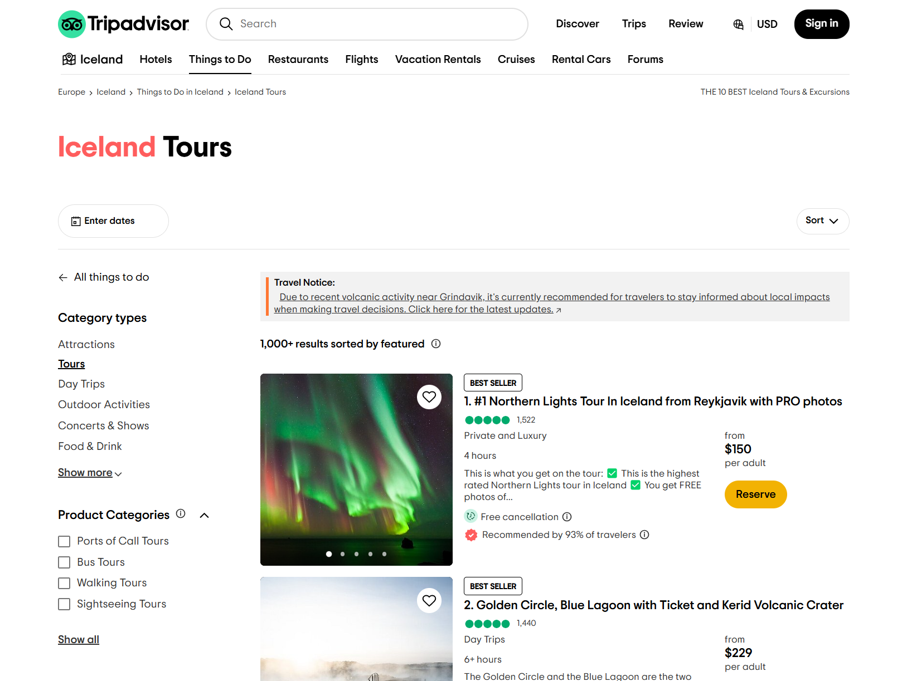
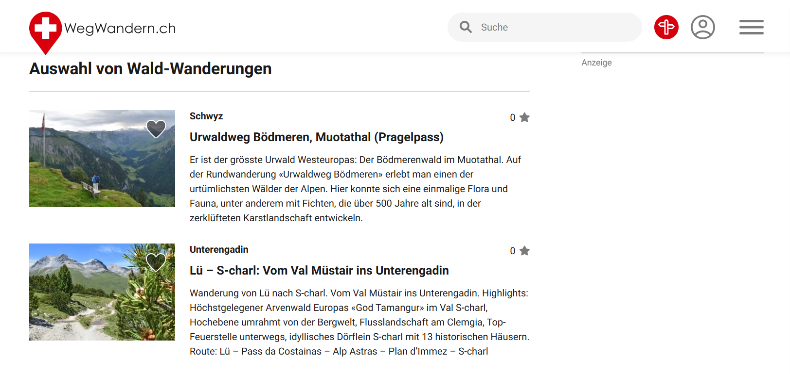

<!-- _class: lead -->

# Swisstination

a community driven platform that connects travelers with Swiss locals to share the hidden gems of Switzerland.

---

## Problemstellung

---

## Problemstellung

---

## Problemstellung

---

## Zielgruppe

- Touristen welche die Schweiz bereisen
- Kurze Ausflüge und Aktivitäten
- Für Schweizer (hidden Gems)

---

## Swisstination

- Persönlich und individuell
- Authentisch und lokal
- Modern und einfach

---

## Datengrundlage

- OSM Datenexport von Moodle
- Alle Ameneties verfügbar
  - Verwendung vopn latitude und longitude

---

## Design

- Neo Brutalism
- Minimalistisch
- Monolithisch (einheitlich, massiv, kompakt)
- Für Mobile und Desktop

---

## Technologie Stack

- Flask Backend mit MongoDB
  - Pydantic Serialisierung
  - User Session Management
  - Endpunkt Authentifizierung
- TypeScript Frontend
  - Eigenes Komponenten System mit Web Components und JSX Support
  - Single Page Application mit eigenem Routing
  - Type Safe API Client

---

## Demo Time - [swisstination.io](http://localhost:5173/)

- Home, Sign In, Tours, Like, Details, Tabs
- Responsiveness (Navbar)
- Live position

---

## Eigenes Komponenten System

- Web Component Integration (Component Class)
- Live Cycle Functions
- Standart Components (Button, Card, etc)
- State Management
- JSX Compiler

---

## Suche und Filter Komponent

- Debounce Logik für Search
- Filter
- API Abfrage nur bei geänderten Filter

---

## Single Page Application Routing

- Custom Router
- Path Router mit dynamischen Parameter
- 404 Handling

---

## User Session Management

- Session Handling
- Hashed Password check
- `user_is_authenticated` Decorator

---

## Voting System

- Benutzer können nur einmal Liken bzw Disliken

---

## DevOps

- Docker Compose
- CI pipelines
- Backend testing mit Database Mocking
- Frontend testing

---

## Fragen?
